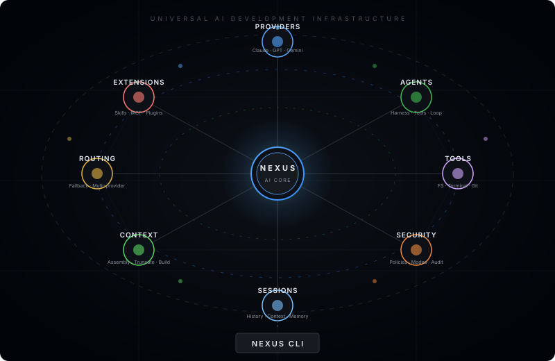
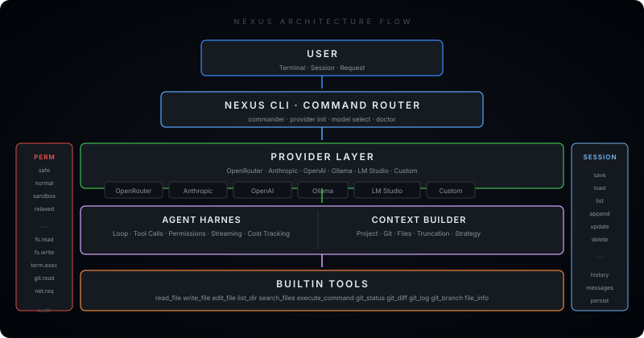
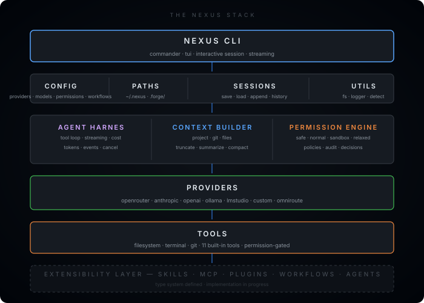

# NEXUS

<div align="center">

**The universal AI development layer for your terminal.**

A model-independent, provider-agnostic AI runtime — unified agent harness, tool system, permissions, and context management in one CLI.

```
git clone https://github.com/qtjg/nexus.git && cd nexus && npm install && npm run build && npm link
```

[](LICENSE)
[](tests)
[](tsconfig.json)
[](https://nodejs.org)
[](#)

</div>

---

<div align="center">
  
</div>

---

## What is NEXUS?

Developers currently juggle multiple tools to accomplish what NEXUS does in one process: a provider client, an agent loop, a tool executor, a permission gate, a context assembler, and a session store. NEXUS unifies all of these into a single, type-safe runtime.

The model is replaceable. The environment, harness, tools, permissions, and developer experience are the product.

**NEXUS is not a chatbot. It is an AI development environment.**

| Without NEXUS | With NEXUS |
|---|---|
| Provider-specific SDKs per project | Single `Provider` interface — swap models without changing code |
| Hand-written agent loops | Battle-tested harness with tool loops, cost tracking, streaming |
| No permission system | Granular policy engine with 4 modes and audit trails |
| Scattered session management | Persistent sessions with full CRUD and history |
| Ad-hoc context assembly | Structured context builder with git, files, and truncation |
| Multiple AI CLIs | One command surface for every provider and workflow |

---

## Core Features

<div align="center">
  
</div>

### 🧠 Provider Abstraction

A single `Provider` interface with `chat()`, `streamChat()`, `healthCheck()`, and `listModels()` — implemented for:

| Provider | SDK | Streaming | Tool Calling |
|---|---|---|---|
| **OpenRouter** | OpenAI SDK | ✅ | ✅ |
| **Anthropic** | `@anthropic-ai/sdk` | ✅ | ✅ |
| **OpenAI** | OpenAI SDK | ✅ | ✅ |
| **Ollama** | OpenAI-compatible | ✅ | ✅ |
| **LM Studio** | OpenAI-compatible | ✅ | ✅ |
| **Custom** | Any OpenAI-compatible endpoint | ✅ | ✅ |
| **Omniroute** | OpenRouter fallback | ✅ | ✅ |

`src/providers/base.ts` · `src/providers/index.ts` · `src/providers/{provider}.ts`

### 🤖 Agent Harness

Autonomous agent loop with:

- Iterative tool call resolution (up to 20 iterations by default)
- Streaming output with cost and token tracking
- Permission checks before every tool execution
- Timeout, token, and cost limits
- Event callback system (`on`/`off`)
- Cancel support

`src/harness/index.ts` · `tests/harness.test.ts`

### 🛠 Built-in Tools

11 permission-gated tools covering the essential developer workflow:

| Category | Tools |
|---|---|
| **Filesystem** | `read_file`, `write_file`, `edit_file`, `list_dir`, `search_files`, `file_info` |
| **Terminal** | `execute_command` |
| **Git** | `git_status`, `git_diff`, `git_log`, `git_branch` |

Each tool declares its `PermissionCategory` and is type-safe via `ToolDefinition`.

`src/tools/definitions.ts` · `src/tools/executor.ts` · `tests/tools.test.ts`

### 🔐 Permission Engine

Granular, auditable permission system with four modes:

| Mode | Behavior |
|---|---|
| `safe` | Ask before every operation (`allow-once`) |
| `normal` | Interactive approval, remembers session |
| `sandbox` | Deny filesystem and terminal by default |
| `relaxed` | Allow everything (`allow-always`) |

13 permission categories across filesystem, terminal, network, git, and extensibility surfaces.

`src/permissions/engine.ts` · `src/permissions/store.ts` · `tests/permissions.test.ts`

### 💾 Sessions

Persistent session storage with full lifecycle:

```
save() → load() → list() → appendMessage() → updateSession() → delete()
```

Sessions are stored as JSON in `.forge/sessions/` (project) or `~/.nexus/sessions/` (global).

`src/sessions/store.ts` · `tests/sessions.test.ts`

### 🔀 Context Builder

Assembles rich, token-efficient context from multiple sources:

- Project files (`package.json`, `README.md`, `pyproject.toml`, etc.)
- Git status and diff
- Source file listings
- Session history
- Tool results

Three context strategies: `truncate` · `summarize` · `compact`

`src/context/builder.ts` · `tests/context.test.ts`

### 🖥 Terminal UI

A lightweight TUI with ANSI rendering:

- Live streaming text display
- Status indicators (`idle` · `running` · `awaiting_permission` · `completed` · `error`)
- Token count and cost estimate display
- Iteration tracking

`src/tui/index.ts`

### ⚡ Configuration

Type-safe config manager with deep-copy isolation (no shared-state mutations):

- Global config: `~/.nexus/config.json`
- Project config: `.forge/config.json`
- Provider and model registries
- Permission policy persistence
- Agent and workflow definitions

`src/config/index.ts` · `src/config/paths.ts` · `tests/config.test.ts`

---

## The NEXUS Stack

<div align="center">
  
</div>

```
┌─────────────────────────────────────────────────────────┐
│  NEXUS CLI                                             │  commander · tui · streaming
├─────────────────────────────────────────────────────────┤
│  Config · Sessions · Paths · Utils                      │  persistent state layer
├─────────────────────────────────────────────────────────┤
│  Agent Harness  ·  Context Builder  ·  Permission Engine │  orchestration layer
├─────────────────────────────────────────────────────────┤
│  Providers  (OpenRouter · Anthropic · OpenAI · Ollama…)  │  model abstraction
├─────────────────────────────────────────────────────────┤
│  Tools  (filesystem · terminal · git · 11 built-in)     │  execution layer
├─────────────────────────────────────────────────────────┤
│  Skills · MCP · Plugins · Workflows · Agents            │  extensibility (type system)
└─────────────────────────────────────────────────────────┘
```

---

## Quick Start

```bash
# Clone, install, build, and link
git clone https://github.com/qtjg/nexus.git
cd nexus
npm install
npm run build
npm link

# Initialize in your project
nexus init

# Configure a provider
nexus provider add anthropic --api-key $ANTHROPIC_API_KEY
nexus provider add openrouter --api-key $OPENROUTER_API_KEY

# Verify everything is healthy
nexus doctor

# Start an interactive session
nexus
```

---

## First Run

```
╭────────────────────────────────────────────────────────╮
│  NEXUS                        claude/sonnet-4-20250514 │
├────────────────────────────────────────────────────────┤
│                                                        │
│  > Type your request...                               │
│                                                        │
├────────────────────────────────────────────────────────┤
│  Tokens: 0            Cost: $0.000     Iterations: 0  │
╰────────────────────────────────────────────────────────╯
```

> *Illustrative terminal output — actual TUI may vary.*

---

## CLI Reference

```
nexus                  Start interactive session
nexus init             Initialize NEXUS in current directory
nexus providers        List all configured providers
nexus provider <id>    Add or inspect a provider
nexus models           List all configured models
nexus model <id>       Set the active model
nexus doctor           Health check for providers and config
nexus help             Show help
```

### Provider Commands

```bash
# Add a provider with API key
nexus provider add anthropic --api-key $ANTHROPIC_API_KEY

# Add a custom OpenAI-compatible provider
nexus provider add custom --base-url http://localhost:1234/v1 --api-key not-needed

# Inspect a provider
nexus provider anthropic
```

### Model Commands

```bash
# List configured models
nexus models

# Switch active model
nexus model use anthropic/claude-sonnet-4-20250514
```

### Interactive Session

```bash
# Start with defaults
nexus

# Force safe mode
nexus --safe

# Force sandbox mode
nexus --sandbox

# Specify provider and model
nexus -p openrouter -m anthropic/claude-sonnet-4-20250514

# Disable streaming
nexus --no-stream
```

### Slash Commands (inside session)

```
/help       Show available commands
/model      Check current model
/tools      List available tools
/permissions Show permission policies
/clear      Clear conversation
/exit       Exit NEXUS
```

---

## Use Cases

### AI-Assisted Coding
Run NEXUS in any project directory. It auto-detects the language (TypeScript, Python, Rust, Go, Ruby) and framework (Next.js, React, Vue, Express, Fastify), injects project context, and helps you write, edit, and debug code with full filesystem and terminal access.

### Model Switching
Swap between Claude, GPT-4, Gemini, or local models without changing your workflow. Configure multiple providers and switch models on the fly with `nexus model use <id>`.

### Local-First Workflows
Run NEXUS with Ollama or LM Studio for fully local, offline AI. No API keys, no egress, no cost — just your model and your machine.

### Secure Automation
The permission engine lets you run NEXUS in `sandbox` mode for untrusted tasks, or `relaxed` mode for trusted automation scripts. Every decision is auditable and persists across sessions.

### Provider-Agnostic Scripts
Write tooling that works with any provider. The `Provider` interface is the contract — swap implementations without touching your harness or tools.

---

## Extensibility

NEXUS is designed to be extended. The type system defines the contracts; implementations grow on top.

```
NEXUS
 ├── Providers        — src/providers/        (OpenRouter, Anthropic, OpenAI, Local)
 ├── Models           — type: Model           (cloud · local · gateway)
 ├── Harness          — src/harness/          (agent loops, tool resolution)
 ├── Tools            — src/tools/            (11 built-in, extensible via ToolDefinition)
 ├── Permissions      — src/permissions/      (engine + file-based store)
 ├── Context          — src/context/          (project assembly, truncation strategies)
 ├── Sessions         — src/sessions/         (persistent history)
 ├── TUI              — src/tui/              (terminal rendering)
 ├── Config           — src/config/           (global + project config)
 ├── Skills           — type: ToolKind='skill'   (type system — implementation pending)
 ├── MCP              — type: ToolKind='mcp'     (type system — implementation pending)
 ├── Plugins          — type: ToolKind='plugin'  (type system — implementation pending)
 └── Workflows        — type: Workflow         (type system — implementation pending)
```

**Implemented today:** Providers, Harness, Tools, Permissions, Context, Sessions, TUI, Config.
**Type system ready:** Skills, MCP, Plugins, Workflows, Agents.

---

## Security & Permissions

NEXUS treats security as a first-class concern, not an afterthought.

### Permission Categories

Every tool action maps to a permission category:

| Category | Covers |
|---|---|
| `filesystem.read` | `read_file`, `list_dir`, `search_files`, `file_info` |
| `filesystem.write` | `write_file`, `edit_file` |
| `filesystem.delete` | File deletion operations |
| `terminal.execute` | `execute_command` |
| `terminal.process` | Process management |
| `network.request` | HTTP/fetch operations |
| `git.read` | `git_status`, `git_diff`, `git_log` |
| `git.write` | Branch operations |
| `git.commit` | Commit operations |
| `git.push` | Push operations |
| `mcp.execute` | MCP tool calls |
| `plugin.execute` | Plugin tool calls |
| `sandbox` | Sandbox boundary enforcement |

### Decision Scopes

Each permission decision supports scopes that control persistence:

| Decision | Scope |
|---|---|
| `allow-once` / `deny-once` | Single execution |
| `allow-session` / `deny-session` | Current session only |
| `allow-project` / `deny-project` | Project `.forge/` directory |
| `allow-always` / `deny-always` | Global `~/.nexus/` directory |

### Permission Store

Decisions are persisted to `~/.nexus/permissions.json` and loaded on startup. The `FilePermissionStore` class implements `PermissionStore` for durability.

`src/permissions/engine.ts` · `src/permissions/store.ts` · `tests/permissions.test.ts`

---

## Configuration

### Global Config

Stored at `~/.nexus/config.json`:

```json
{
  "version": "0.1.0",
  "defaultProvider": "anthropic",
  "defaultModel": "anthropic/claude-sonnet-4-20250514",
  "permissionMode": "safe",
  "streaming": true,
  "context": {
    "maxTokens": 100000,
    "includeGitStatus": true,
    "includeProjectFiles": true,
    "includeToolResults": true,
    "includeSessionHistory": true,
    "includeSkillInstructions": false,
    "includeMcpResources": false,
    "strategy": "truncate"
  },
  "providers": [],
  "models": [],
  "permissions": [],
  "tools": [],
  "workflows": [],
  "telemetry": false
}
```

### Project Config

Stored at `{project}/.forge/config.json` — overrides global config at the project level.

### Environment Variables

```bash
export ANTHROPIC_API_KEY=sk-ant-...
export OPENAI_API_KEY=sk-...
export OPENROUTER_API_KEY=sk-or-...
export NEXUS_DIR=~/.nexus    # Override default config directory
```

`src/config/index.ts` · `src/config/paths.ts` · `tests/config.test.ts`

---

## Development

```bash
# Clone and install
git clone https://github.com/qtjg/nexus.git
cd nexus
npm install

# Build TypeScript
npm run build

# Link globally for local testing
npm link

# Run tests
npm test

# Run tests in watch mode
npm run test:watch

# Type check
npm run typecheck

# Run in development mode
npm run dev
```

## Installing from Published Package

Once published to npm:

```bash
npm install -g nexus
```

> **Note:** If your system has a root-owned global npm prefix (e.g. `/usr/lib/node_modules` on Arch Linux), configure a user-local prefix instead:
>
> ```bash
> npm config set prefix '~/.local/npm'
> export PATH="$HOME/.local/npm/bin:$PATH"
> npm install -g nexus
> ```

### Project Structure

```
nexus/
├── bin/nexus.js            # CLI entry point
├── src/
│   ├── cli/index.ts        # Commander.js command definitions
│   ├── config/             # Config manager & path resolution
│   ├── context/            # Context assembly & truncation
│   ├── harness/            # Agent loop orchestration
│   ├── permissions/        # Permission engine & file store
│   ├── providers/          # Provider implementations
│   ├── sessions/           # Session persistence
│   ├── tools/              # Tool definitions & executor
│   ├── tui/                # Terminal UI renderer
│   ├── types/              # Core type system
│   └── utils/              # FS helpers & logger
├── tests/                  # 40 tests across 8 suites
├── dist/                   # Compiled output
├── package.json
└── tsconfig.json
```

---

## Testing

```
npm test

▶ ConfigManager
  ✔ should create default config
  ✔ should add and retrieve providers
  ✔ should list all providers
  ✔ should add and retrieve models
  ✔ should set and get default model
  ✔ should persist config to disk
  ✔ should remove providers
  ✔ should set permission mode

▶ ContextBuilder
  ✔ should build context with project files
  ✔ should handle missing project info
  ✔ should apply truncation strategy

▶ AgentHarness
  ✔ should create harness with defaults
  ✔ should have a working getState
  ✔ should reset session state
  ✔ should cancel running operation

▶ PermissionEngine
  ✔ should default to safe mode
  ✔ should allow once decision
  ✔ should deny always decision
  ✔ should remember session decisions
  ✔ should switch modes
  ✔ should list all policies
  ✔ should infer correct categories
  ✔ should persist to file store
  ✔ should handle unknown tool names
  ✔ should clear session decisions

▶ SessionStore
  ✔ should save and load a session
  ✔ should list sessions
  ✔ should append messages
  ✔ should update session
  ✔ should delete a session
  ✔ should handle missing session gracefully
  ✔ should return empty list for non-existent dir

▶ Tool Executor
  ✔ should execute read_file tool
  ✔ should list directory contents
  ✔ should have all builtin tools with required fields
  ✔ should have at least 10 builtin tools
  ✔ should handle missing file gracefully

▶ Provider Types
  ✔ should have valid Provider interface shape
  ✔ should define ChatResponse shape

▶ Tool Types
  ✔ should export BUILTIN_TOOLS
  ✔ should have tools with required fields
  ✔ should have at least 10 builtin tools

ℹ tests 40
ℹ suites 8
ℹ pass 40
ℹ fail 0
```

All 40 tests pass consistently. Run with `npm test` or `npm run test:watch`.

---

## Roadmap

| Status | Feature |
|---|---|
| ✅ | Provider abstraction (OpenRouter, Anthropic, OpenAI, Ollama, LM Studio) |
| ✅ | Agent harness with tool loops |
| ✅ | 11 built-in tools (filesystem, terminal, git) |
| ✅ | Permission engine (4 modes, 13 categories) |
| ✅ | Context builder with truncation strategies |
| ✅ | Session persistence (CRUD) |
| ✅ | TUI with streaming and cost tracking |
| ✅ | Config manager (global + project) |
| ✅ | 40 passing tests |
| 🗺 | Skills system |
| 🗺 | MCP server integration |
| 🗺 | Plugin system |
| 🗺 | Workflow engine |
| 🗺 | Multi-agent support |
| 🗺 | Web search tool |
| 🗺 | Structured output / JSON mode |
| 🗺 | Cross-platform TUI improvements |

---

## Project Status

**NEXUS v0.1.0 — Early development**

A working, tested foundation for a universal AI development platform. The core runtime — providers, harness, tools, permissions, context, and sessions — is implemented and tested. The extensibility layer (skills, MCP, plugins, workflows) has type definitions ready and is awaiting implementation.

---

## Contributing

Contributions are welcome. Here's how to get started:

1. Fork the repository
2. Create a feature branch: `git checkout -b feat/my-feature`
3. Make your changes — ensure all 40 existing tests pass
4. Add tests for new functionality
5. Run `npm run typecheck` to verify types
6. Commit with a clear message
7. Push and open a pull request

**Requirements:**
- All new features must include tests
- TypeScript strict mode must pass (`npm run typecheck`)
- `npm test` must pass with zero failures
- Follow existing code style and naming conventions

---

## License

[MIT](LICENSE) — Copyright © 2026 NEXUS Contributors

---

<div align="center">

```
Build with every model.
Route through every capability.
Operate from one terminal.
```

`github.com/qtjg/nexus` · `npmjs.com/package/nexus` · `v0.1.0`

</div>
